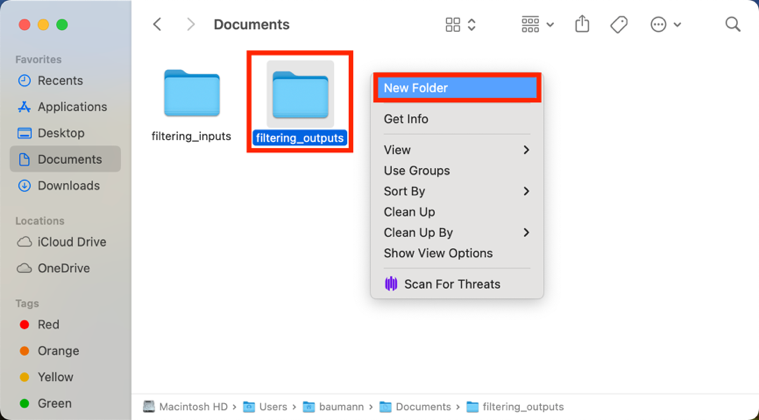

> *This tutorial will show you how to use a Python code to filter
> downloaded ECOSTRESS images for those with good quality.*

# Table of Contents

[What Makes an Image Good Quality?
[1](#what-makes-an-image-good-quality)](#what-makes-an-image-good-quality)

[Setting Up your Project Folder
[2](#setting-up-your-project-folder)](#setting-up-your-project-folder)

[Using the Filtering Code
[5](#using-the-filtering-code)](#using-the-filtering-code)

# What Makes an Image Good Quality?

Good is subjective, but for this tutorial we will assume that a good
quality image is one that is georeferenced, not very cloudy, and has
limited no data values.

An image is considered georeferenced when it has been given coordinates
that align with the part of the Earth that the image is from. This makes
sure that every point on the map corresponds to a real-world location,
which makes using it with other geographic data possible. When you
download ECOSTRESS data from AppEEARS, a statistics CSV file from the
metadata will give you information on if the image has been
georeferenced or not. Most ECOSTRESS data over land is correctly
georeferenced, however those images over the ocean are not always as
accurate, so it is good to check.

Also, the QC files associated with the image that you downloaded will
give you even more quality information related to cloud cover and
missing data. While this code does not apply a cloud or QC mask, it does
filter the images based on those metrics. You can even customize the
code to decide how strict you would like to filter according to those
quality metrics.

## Setting Up your Project Folder

1.  First, let us create **an input directory** with all of the files we
    need for this code. Find your request on the **AppEEARS** website
    and go to the **download** page.

**Tip**: If you do not know how to make a request on the AppEEARS
website, see the **Downloading from AppEEARS** tutorial. Make sure you
have **QC** files requested in addition to your ECOSTRESS product files.
Oftentimes, QC files are **automatically** included in your requested
files because they are important for good research.

However, to **ensure** they will be present in your requested files on
AppEEARS, you can add them as a requested layer. Whatever product you
are downloading, scroll through the options and look for **QC**, then
press the **plus** to add it to your requested layers.

2.  First, under **Supporting Files**, look for the file that ends in
    **Statistics.csv**. Click on it to **download**.

**Example:**

**Tip**: The **statistics CSV** file contains a lot of information about
the files you downloaded. We are specifically interested in the column
titled **Orbit Correction Preformed**. The values in this column are
either **True** or **False** for each row/file. **True** means that the
image has been georeferenced. **False** means that it has not. We only
want to use images labeled **True**.

3.  Then, **scroll down** to the main files section. Click on the empty
    box next to **Name** to select all files. A **checkmark** should
    appear next to all of the files, including your layer of interest
    (LST, ET, etc.) and your QC files. Then select the **Download**
    dropdown on the right and select **Download Files**. Wait for your
    files to finish downloading.

4.  Next, open your **finder** and go to the **downloads** folder.
    Select all the files including your **layer of interest**, **QC
    files**, and the **Statistics CSV**. **Right click** on one of the
    selected files and select **New Folder with Selection**. Name the
    new folder so that you know it is the **input folder** for your
    filtering code.

5.  Now, **move** the inputs folder into your **documents** folder.
    Then, **right click** and select **New Folder**. Name the new folder
    so that you know it is for your filtering code **outputs**.

6.  Finally, **right click** and select **New Folder** one more time.
    This time we are creating a **project folder** for the code, so name
    it accordingly. Move the **inputs** and **outputs** folders into the
    project folder.

7.  Finally, go to
    **<https://github.com/ECOSTRESS-Tutorials/ECOSTRESS-Filtering-for-Good-Images>**
    and download the **Filtering_for_good_images** code. Move this code
    into the **project folder**.

Now, your project folder is all set up to use with your Filtering for
Good Images code!

## Using the Filtering Code

1.  First, open **Visual Studio Code** and use **File \> Open Folder…**
    to get connected to the main **project folder** that contains the
    input folder, output folder, and the Filtering_for_good_images code.

|  |  |
|----|----|

2.  In the **EXPLORER** tab, find the **Filtering_for_good_images** code
    and **click** on it to open it.

>  style="width:5.42497in;height:2.89679in"
> alt="Graphical user interface, text, application Description automatically generated" />

**Tip**: If you want to know more about what each line of the code does,
read the **comments** in the code. Comments in the code are identified
by **\#**. These comments do not actually change how the code runs, but
they can be helpful to put notes on how the code works for yourself or
other users. This can also be helpful if you want to customize the code
because it will guide you to which parts you may want to change!

**Examples** of comments (**green text following the \#):**

3.  Find the section of the code titled **Set the Directories**. Find
    the variable called **input_directory**. Change the text that says
    **"Replace_this_text_with_folder_path"** to the path of the main
    folder where your ECOSTRESS files are stored.

1.  To **copy the folder path**, use the **EXPLORER** panel on the left
    side of Visual Studio Code to find the folder you are interested in.
    Once you have found it, **right click** on it and select **Copy
    Path**. Now you can paste the path into your code. Make sure it is
    still **wrapped in quotes** and has **r** outside the first quote.

4.  Then, find the variable called **output directory**. Change the text
    that says **"Replace_this_text_with_folder_path"** to the path of
    the folder where you want the output files to be stored. Make sure
    it is still **wrapped in quotes** and has **r** outside the first
    quote.

> **Example Directory Set-up:**
>
>  style="width:5.5in;height:1.03889in"
> alt="Text Description automatically generated" />

5.  Now the code should be set up to be run with your images. Scroll
    back to the top to the section titled **Import the Necessary
    Libraries**. This is the first block of code we want to run. Click
    into the box with the library importing code and press
    **Shift+Return** to run it.

6.  At the top of the window, a pop up will appear prompting you to
    **select a kernel** to run your code with. Click on **Python
    Environments …**

7.  Select the **ECOSTRESS** environment that you created, or another
    one if you have a different one you want to use.

**Tip**: If you do not have an ECOSTRESS environment set up, follow the
**Creating an Environment** tutorial to make one.

8.  Let the code run for a few seconds. You will see the **seconds
    counting up** in the bottom left of the cell. You will know it is
    done when a **green check mark** appears.

9.  Continue this process of running each block of code, in order from
    top to bottom, by clicking into the module with the code and
    pressing **Shift+Return**.

    1.  The code is set up to give you specific **warnings** based off
        certain things being **missing** from the input directory. If
        you get one of these warnings, **fix** what is wrong with your
        input directory and **run the code again**.

**Example of if you forgot to include the statistics CSV in the input
directory:**

10. Once the code is done running, check in your **output directory**
    folder. Different **sub-folders** will be present with images in
    them. If one or more of these sub-folders are not present, it just
    means that none of the images you inputted fell into that category.

1.  The **Cloudy** folder contains images that were filtered out for
    high cloud cover.

2.  The **Good** folder contains images that were deemed good by all
    three standards, based on the user defined threshold. Use the images
    in this folder for your **future analysis**.

3.  The **No Data** folder contains images that were filtered out for
    having high amounts of null pixels.

4.  The **QF** folder contains the processed versions of the QC files
    where specific flags for clouds and no data have been applied.

5.  The **Bad Georeference** folder contains images that were filtered
    out because they were not georeferenced.

You now know how to use code to automatically filter for good quality
images! Make sure to use the images from the **Good** folder in future
analysis!
